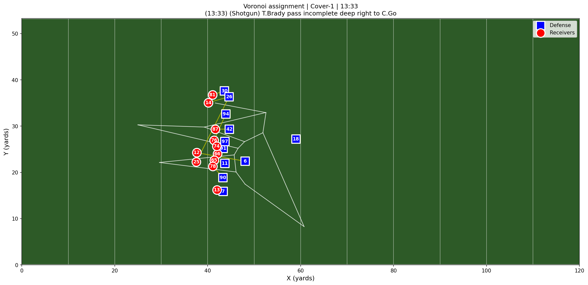

# NFL Coverage Responsibility Engine

Analyzes NFL player-tracking data to infer **which defender is responsible 
for which receiver** on every passing play, using spatial geometry and 
motion analysis. Emphasizes explainability over black-box prediction.



## What it does

- **Zone coverage**: Voronoi spatial decomposition of defender positions at 
  the snap — each defender's cell defines their area of responsibility
- **Man coverage**: Frame-by-frame motion correlation between defenders and 
  receivers between snap and pass to identify shadowing assignments
- **Pre-snap feature engineering**: cushion distance, safety depth, CB 
  alignment, defenders in box — used for man/zone classification (Phase 3)

## Current status

Phase 1 complete, Phase 2 engine functional:
- Data loading, normalization, and validation pipeline (`src/data_processing.py`)
- Full visualization layer with field plots and animations (`src/visualization.py`)
- Deterministic coverage assignment engine (`src/coverage_assignment.py`)
- Pre-snap feature extraction (`src/coverage_features.py`)
- Validated on 7,400+ standard passing plays from NFL Big Data Bowl 2023

## Planned (Phase 3+)

- XGBoost classifier for man/zone prediction with SHAP explainability
- FastAPI backend + JavaScript dashboard for interactive play visualization
- Full dataset expansion across all 9 weeks (~85,000 plays)

## How to run
```bash
pip install -r requirements.txt
jupyter notebook
```

Open `notebooks/01_data_validation.ipynb` first, then
`notebooks/02_coverage_assignment.ipynb`.

Data files are not included — download from
[NFL Big Data Bowl 2023](https://www.kaggle.com/competitions/nfl-big-data-bowl-2023/data)
and place CSVs in `data/raw/`.

## Stack

Python, NumPy, SciPy, pandas, scikit-learn, Matplotlib

## Project structure

- `src/` — reusable modules for data processing, assignment engine,
  features, and visualization
- `notebooks/` — validation and exploration notebooks
- `data/raw/` — local CSVs (gitignored)
- `requirements.txt` — pinned dependencies for Python 3.10+